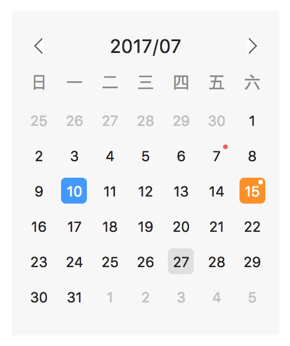

# react-calendar-card
React Calendar Card Component.



## Installation

The package can be installed via NPM:

```
npm install react-calendar-card --save
```
## Getting Started
The example below shows how to include the css from this package if your build system supports requiring css files (webpack is one that does).
The component default language is English. To use Chinese, you should add `language="zh_CN"` to the `Calendar` props just like the example below.
```js
import React from 'react';
import moment from 'moment';
import Calendar from 'react-calendar-card';

import 'react-calendar-card/dist/style.css';

class Example extends React.Component {
  constructor (props) {
    super(props)

    const tags = [7, 15];
    const year = moment().year();
    const month = moment().month() + 1;
    const day = moment().date();

    this.state = {
      tags: tags,
      year: year,
      month: month,
      day: day
    };
  }

  selectDate(year, month, day) {
  }

  previousMonth(year, month) {
  }

  nextMonth(year, month) {
  }

  render() {
    const { tags, year, month, day } = this.state;

    return <Calendar
      onSelectDate={this.selectDate.bind(this)}
      onPreviousMonth={this.previousMonth.bind(this)}
      onNextMonth={this.nextMonth.bind(this)}
      year={year}
      month={month}
      day={day}
      tags={tags}
      language="zh_CN" />;
  }
}
```
